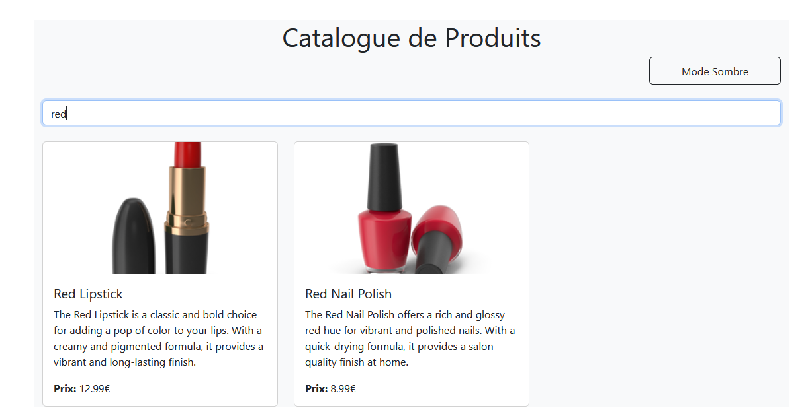

# Exercice 1 : État et Effets

## 1.1 Modifier le composant ProductSearch pour utiliser la recherche 
1. Dans App j'ai créé un état seartTerm avec useState pour stocker le texte tapé par l user.
2. J ai passe la fonction setSearchTerm comme prop a ProductSearch pour à chaque fois que l user tape le champ de recherche met à ajoour seartTerm dans App
3. dans productList j'ai utilisé searchTerm pour filtrer les produits avant de les affichers 

## 1.2 Implémenter le debounce sur la recherche
1. j'ai créé un fichier nommé hooks/useDebounce.js ou j'ai définit un hook qui ajoute un debounce a une valeur ( attend une période avant de mettre a jour la valeur)
2. Ensuite, je me suis occupée du composant ProductSearch pour qu'il utilise le hook useDebounce.j'ai importé le hook , j'ai ajouté un état local pour capturer les saisies immédiates de l'utilisateur et j'ai appliqué useDebounce à localSearch pour obtenir une version retardée appelée debouncedSearchTerm.Enfin, avec un useEffect, j'ai mis à jour l'état global searchTerm après que le délai de debounce ait pris fin.

# Exercice 2 : Context et Internationalisation

##  2.1 Créer le LanguageContext
J'ai utilisé createContext pour créer un LanguageContext (context/LanguageContext) qui contient la langue actuelle et une fonction pour le mettre à jour puis j'ai enveloppé tous les composants de l'app avec LanguageProvider dans App ce qui permet a tous les composants enfants d'accéder à la langue.
J'ai ajouté un objet translations qui contient toutes les traductions nécessaires ( le recherche , mode , prix ) pour le fr et ang .

# 2.2 Ajouter le sélecteur de langue
